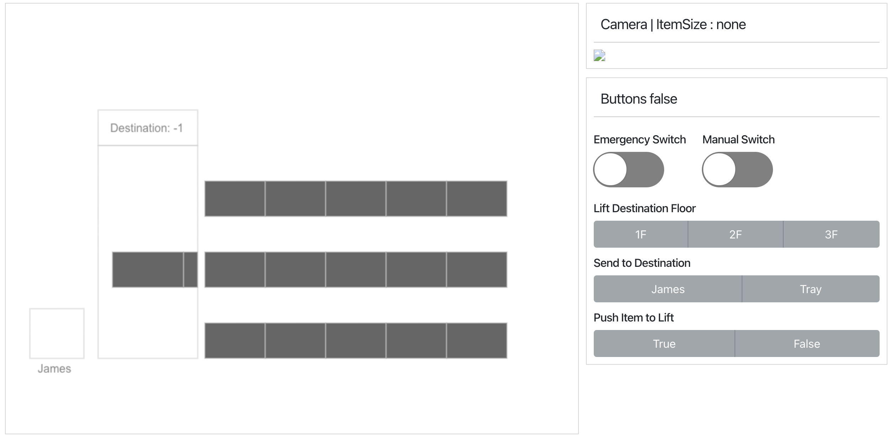

# Watt React Project

## ROS <-> Websocket 설치 & 실행
설치

`sudo apt install ros-melodic-rosbridge-suite`

실행

`roslaunch rosbridge_server rosbridge_websocket.launch`


## yarn 설치 및 실행

Install yarn

```

curl -sS [https://dl.yarnpkg.com/debian/pubkey.gpg](https://dl.yarnpkg.com/debian/pubkey.gpg) | sudo apt-key add -

echo "deb [https://dl.yarnpkg.com/debian/](https://dl.yarnpkg.com/debian/) stable main" | sudo tee /etc/apt/sources.list.d/yarn.list

sudo apt update

sudo apt install yarn

```

Install node
```
Install node.js 14.x

curl -sL [https://deb.nodesource.com/setup_14.x](https://deb.nodesource.com/setup_6.x) -o nodesource_setup.sh

sudo bash nodesource_setup.sh

sudo apt install nodejs

sudo apt install build-essential
```
Install react-scripts
```
npm install react-script
```

## 웹페이지 실행

`yarn`

`yarn start`

### (option) webcam server

Install 

`sudo apt-get install ros-melodic-web-video-server`

`rosrun web_video_server web_video_server`

## Screenshot



